# chapter 1: Fundamentals

## Definitions:

### Computer network:

- A `computer network` is a set of `nodes` connected by `communication links`, or A computer network is a collection of interconnected devices that communicate with each other to share resources and information. These devices can include computers, servers, smartphones, and other digital equipment.

- A `node` can be a computer printer or any other device capable of sending or receiving data.

- A `communication link` refers to a physical (wired) or virtual (wireless) connection that enables communication between two or more devices or entities in a network.

- `End devices` are devices that originate or consume data within a network. They are the final destination or source of data transmission.

- `Intermediary devices` are network devices that facilitate communication between end devices and ensure data is transferred efficiently across the network.

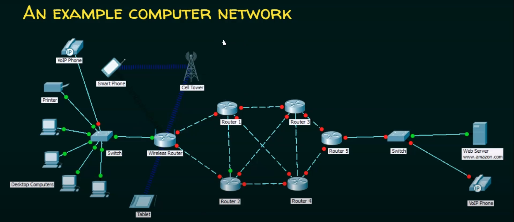

## Basic characteristics any computer network:

### Fault tolerance

- `Fault tolerance` is the capability of a network to continue operating correctly even when one or more of its components fail.
Fault tolerance is Ability to continue operating despite failures or malfunctions.

### Scalability

- `Scalability` is the ability of a network to grow and handle an increasing amount of work or accommodate expansion without compromising performance.

### Quality of Service

- `Quality of Service` refers to the set of technologies and policies used to manage and prioritize network traffic to ensure the performance of critical applications.

### Security

- `Security` involves protecting the network and its data from unauthorized access, attacks, and other threats to ensure confidentiality, integrity, and availability.

## Network Protocols & Communications:

### Data communication:

- `Data communications` are the exchange of data between two nodes via some form of `link` or `transmission medium` sush as cable.

### Data transmission:

- `Data transmission` also known as `data flow`, refers to the process of sending data from one point to another through a communication channel. It involves the movement of data between devices

#### -> Data Transmission Modes:

- Simplex: Data flows in one direction only (e.g., TV broadcast).
- Half-Duplex: Data flows in both directions, but not simultaneously (e.g., walkie-talkies).
- Full-Duplex: Data flows in both directions simultaneously (e.g., telephone conversations).

### Network Protocols:

- `Protocols` are a sets of rules that define (govern) how data is transmitted and received over a network. They ensure that devices on a network can communicate effectively.

#### The elements of a protocol:

1) Message Encoding:

- Definition: Message encoding specifies how data is converted into a format suitable for transmission. A source message from the sender is encoded into signals or waves then transmitted through a medium wired/wireless then received and decoded and the message is passed to the destination.
- Purpose: Ensures that data can be correctly interpreted by the receiving device.
- Example: Converting text characters into binary code using encoding schemes like ASCII or UTF-8.

2) Message Formatting and Encapsulation:

- Definition: Formatting and encapsulation involve structuring the data into packets or frames and adding protocol-specific headers and trailers.
- Purpose: Organizes data for efficient transmission and includes control information for routing and error checking.
- Example: An IP packet includes a header with source and destination IP addresses, while an Ethernet frame includes MAC addresses.

3) Message Timing:

- Definition: Message timing refers to the synchronization and timing rules for data transmission.
- Purpose: Ensures coordinated data exchange between sender and receiver, preventing collisions and ensuring efficient use of network resources.
- Example: TCP uses timing mechanisms to manage data flow and retransmissions, ensuring reliable communication.

4) Message Size:

- Definition: Message size defines the maximum size of data packets or frames that can be transmitted.
- Purpose: Ensures compatibility with network hardware and protocols, and optimizes data transfer efficiency.
- Example: Ethernet frames typically have a maximum size of 1500 bytes, known as the Maximum Transmission Unit (MTU).

5) Message Delivery Options (Transmission Methods):

- These are the various ways data can be transmitted across a network. They include:

    

    - Unicast: One-to-one communication where data is sent from one sender to one receiver.
    
    <!-- 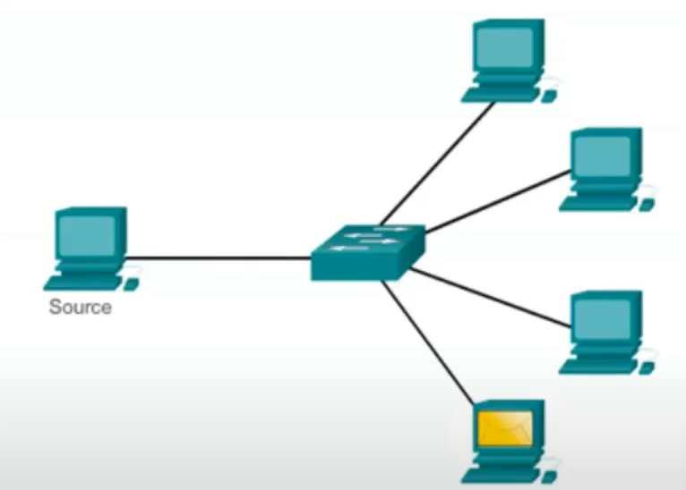 -->
    
    

        
    

    - Multicast: One-to-many communication where data is sent from one sender to multiple receivers who have expressed interest in receiving the data.

    

        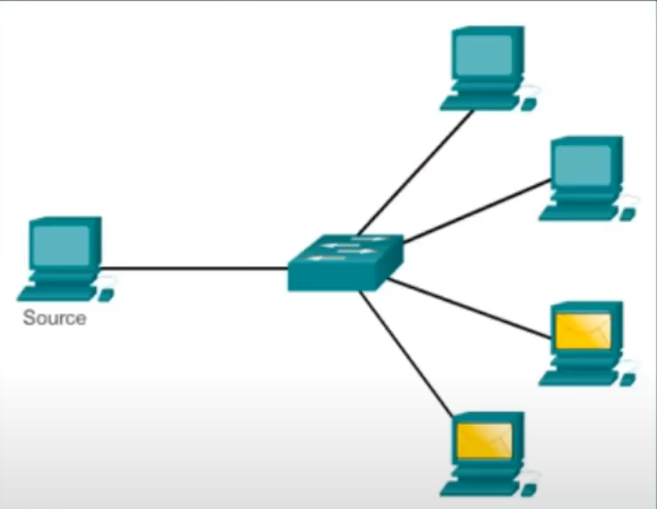
    

    - Broadcast: One-to-all communication where data is sent from one sender to all devices within a specific network segment or broadcast domain.
    
    

        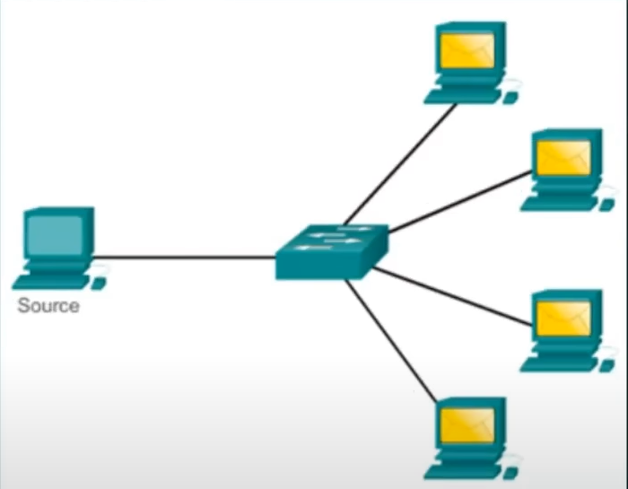
    

    
    

    - Purpose: Transmission methods determine how data is directed and distributed across the network based on the specific communication needs and the characteristics of the recipients.

Examples:

- Unicast: Sending an email to a specific recipient.
- Multicast: Streaming a live video feed to multiple viewers.
- Broadcast: Broadcasting network discovery packets to all devices on a local network.

### Types of network architectures:

- Peer-to-Peer network:
    - Peer-to-peer (P2P) is defined as a decentralized network architecture in which participants, called peers, interact directly with each other without the need for a central authority or server.
    - In a P2P network, each participant acts as both a client and a server, enabling them to share resources and services directly with other peers.
    - not scalable.

    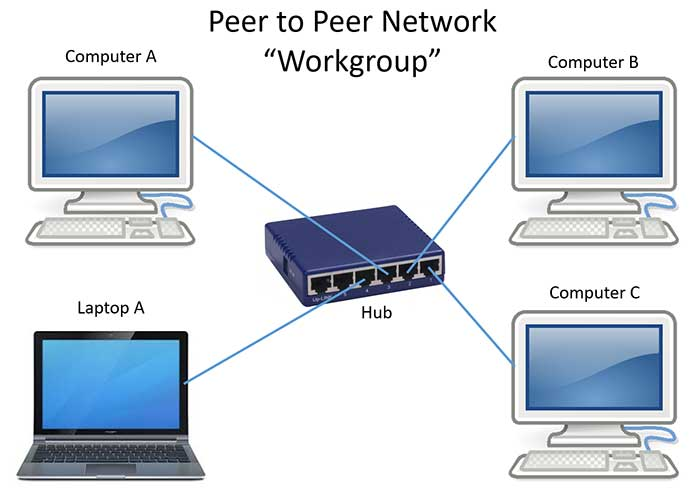

- Client-Server network:

    - A client-server network is a computing model in which multiple clients connect to a central server to access resources, such as files, applications, and data. The server acts as a central hub, managing and providing services to the connected clients.
    - Request-Response model.
    - Server may be overloaded.
    - Scalable.

    

### Componenets of a computer network:

`** Nodes: **`
- End nodes (End devices): The starting point or the end point in the communication.
> Example: Computers, Network printers, VoIP phone ...
- Intermediary nodes: Are nodes that just forwards the from one to another.
> Example: Switches, Bridges, Hubs, Routers, Security devices (Firewall), Repeaters, Cell Tower ...

`** Media: **`
- It is also called the link that carry the data from one side to another. There are two types: wired meduim (guided meduim), wireless meduim (unguided meduim).

1) Wired Media:
- Ethernet straight-through cable: To connect different devices.
- Ethernet crossover cable: To connect devices of the same kind.

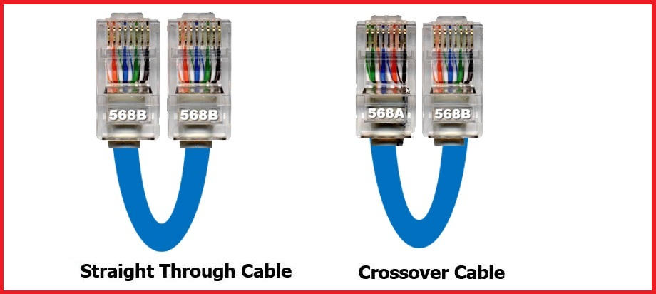

- Fiber Optic cable.

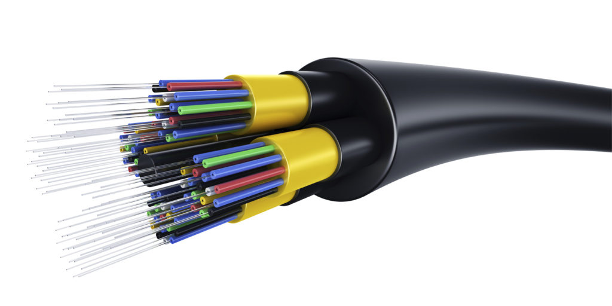

- Coaxial cable.

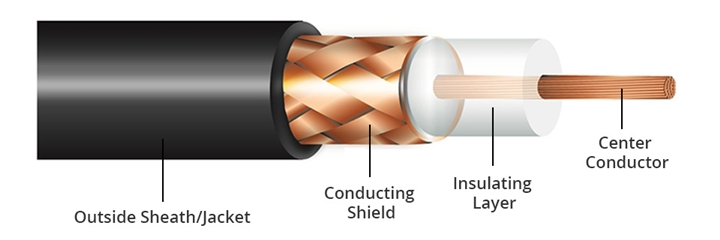

- USB cable.

 

2) wireless Media:

- Infrared Waves (Short range communication - TV remote control).
- Radio Waves (Bluetooth, Wi-Fi).
- MicroWaves (Long distance communication - Cellular System).
- Satellite Waves (Ultimately the long distance communication).

`** Services: **`
- e-Mail.
- Storage services.
- File sharing.
- Instant messaging.
- Online games.
- Surfing internet. 

## Classification (or types) of Computer Networks:

### Local Area Network (LAN).

- A local area network (LAN) is a computer network that interconnects computers within a limited area sush as a residence. school ...

- Local Area Network is a group of computers connected to each other in a small area such as building, office.

**LAN devices:**
- Wired LAN (Example: Ethernet - Hub, Switch).
- Wireless LAN (Example: Wi-Fi).

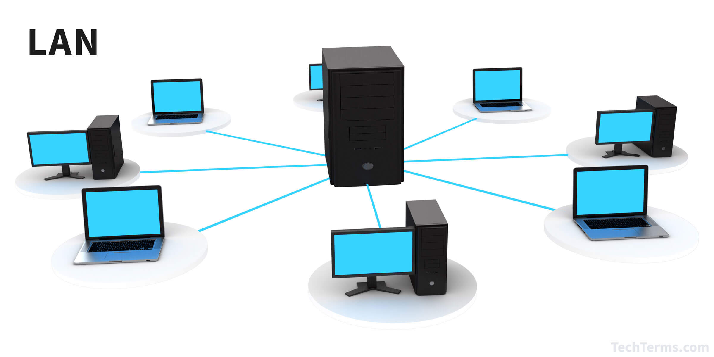

### Metropolitan Area Network (MAN).

- A Metropolitan Area Network is a computer network that interconnects users with computer resources in a geographic region of the size of a metropolitan area (city).

**MAN devices:**
- Swiches/Hubs (to establishing a local erea network).
- Routers/Bridges (to connect local area networks).

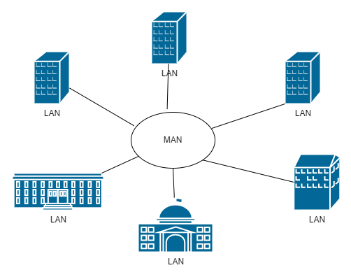

### Wide Area Network (WAN).

- A Wide Area Network telecommunications network (any communications at a distance we call it as a telecommunication network) that extends over a large geographical area 

**WAN devices:**
- End devices and Intermediary devices.

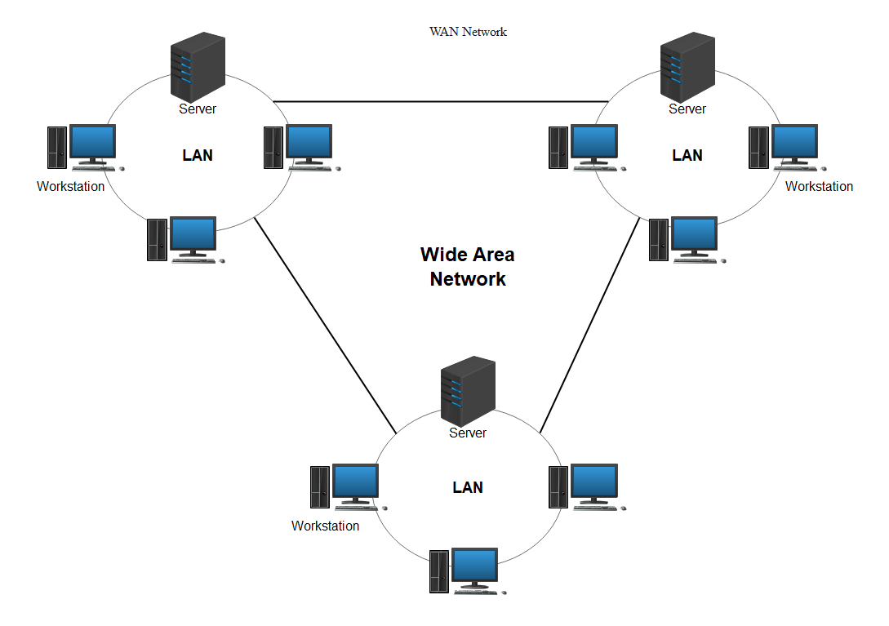

## Network Topologies:

- Network topology (layout) is an arragement of a computer network.

<!-- 
### The process of message transmission and reception:

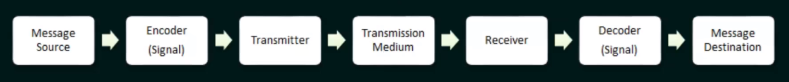

1) Message Source:

- This is where the original data or message originates. It could be generated by a user, an application, or a device within the network. The message could be text, multimedia, or any form of data that needs to be transmitted.

2) Encoder:

- The encoder processes the message from its original form into a format suitable for transmission over the network. This includes converting the data into a digital signal that can be effectively transmitted through the chosen communication medium. Encoding may involve converting characters into binary code (ASCII, UTF-8), compressing data for efficiency, or applying encryption for security.

3) Transmitter:

- The transmitter converts the encoded signal into a physical form that can be sent through the transmission medium. This could be electrical signals (in wired networks) or electromagnetic waves (in wireless networks). The transmitter prepares the signal for transmission according to the specifications of the network protocol being used.

4) Transmission Medium:

- This refers to the physical path through which the encoded signal travels from the transmitter to the receiver. It could be a copper wire (in Ethernet cables), optical fiber (in fiber-optic cables), or the air (in wireless communication). The transmission medium carries the signal over a distance, subject to various factors like attenuation, noise, and bandwidth limitations.

5) Receiver:

- The receiver captures the transmitted signal from the transmission medium. It processes the signal to extract the encoded data, preparing it for decoding. The receiver may involve hardware components (such as antennas or network interface cards) and software protocols to interpret and manage incoming data.

6) Decoder:

- The decoder reverses the encoding process, converting the received signal back into its original digital form. It interprets the encoded data, reversing any compression, encryption, or modulation that was applied during encoding. The decoder ensures that the received message matches the original message sent by the source.

7) Message Destination:

- Finally, the decoded message reaches its intended destination, which could be another device, application, or user within the network. The destination uses the received data for its intended purpose, such as displaying text, processing commands, or storing information in a database. -->

<!-- - protocols used in network communication play a critical role in defining various aspects beyond just data transmission. They encompass a wide range of functions and specifications to ensure efficient and reliable communication between devices. Here's how protocols define these aspects:

1. Message Encoding, Formatting, and Encapsulation
Encoding: Protocols specify how data should be encoded into binary format for transmission over the network. Different encoding schemes, such as ASCII, UTF-8, or binary formats, may be used depending on the type of data and the protocol being employed.

- Formatting: Protocols define the structure and format of data packets or frames. This includes specifying fields such as headers, trailers, and data payload sizes. For example, in Ethernet frames, there are fields for source and destination MAC addresses, frame type, data payload, and CRC for error detection.

- Encapsulation: Protocols encapsulate data by adding protocol-specific headers and trailers to the original data. Each layer of the OSI (Open Systems Interconnection) or TCP/IP model adds its own headers or trailers to the data as it passes through the network stack.

2. Message Timing
Timing: Protocols govern when data packets should be transmitted and how timing is synchronized between sender and receiver. Timing aspects include data transmission rates (bandwidth), latency (delay in transmission), and synchronization methods to ensure that data is transmitted and received in a coordinated manner.
3. Message Size
- Message Size: Protocols define the maximum size of data packets or frames that can be transmitted over the network. This maximum transmission unit (MTU) varies depending on the protocol and the type of network medium (e.g., Ethernet, Wi-Fi). Large messages may be fragmented into smaller packets to fit within the MTU size.
4. Message Delivery Options
Delivery Options: Protocols specify options for delivering data packets, including:

- Reliable vs. Unreliable Delivery: Protocols like TCP provide reliable delivery, ensuring that all data packets are received and in the correct order. UDP, on the other hand, offers unreliable delivery, where some packets may be lost or arrive out of order.

- Flow Control: Protocols manage the flow of data between sender and receiver to prevent congestion and optimize performance. Flow control mechanisms regulate the rate at which data is transmitted based on network conditions and the receiver's ability to process data.

- Error Handling: Protocols include mechanisms for error detection (e.g., checksums, CRC) and error recovery (e.g., retransmission of lost packets) to ensure data integrity and reliability during transmission. -->