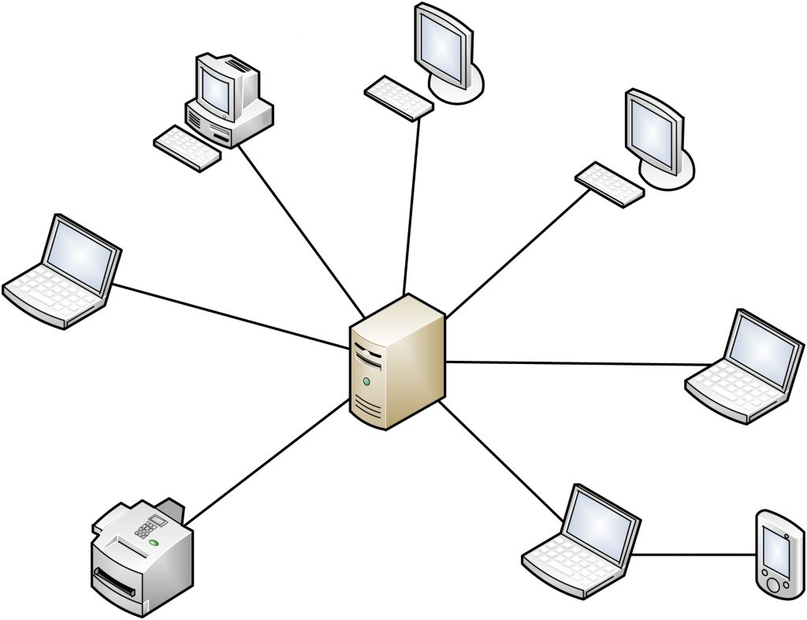

# chapter 1: Fundamentals

## Definitions:

### Computer network:

- A `computer network` is a set of `nodes` connected by `communication links`, or A computer network is a collection of interconnected devices that communicate with each other to share resources and information. These devices can include computers, servers, smartphones, and other digital equipment.

- A `node` can be a computer printer or any other device capable of sending or receiving data.

- A `communication link` refers to a physical (wired) or virtual (wireless) connection that enables communication between two or more devices or entities in a network.

- `End devices` are devices that originate or consume data within a network. They are the final destination or source of data transmission.

- `Intermediary devices` are network devices that facilitate communication between end devices and ensure data is transferred efficiently across the network.


## Basic characteristics any computer network:

### Fault tolerance

- `Fault tolerance` is the capability of a network to continue operating correctly even when one or more of its components fail.
Fault tolerance is Ability to continue operating despite failures or malfunctions.

### Scalability

- `Scalability` is the ability of a network to grow and handle an increasing amount of work or accommodate expansion without compromising performance.

### Quality of Service

- `Quality of Service` refers to the set of technologies and policies used to manage and prioritize network traffic to ensure the performance of critical applications.

### Security

- `Security` involves protecting the network and its data from unauthorized access, attacks, and other threats to ensure confidentiality, integrity, and availability.

## Network Protocols & Communications:

### Data communication:

- `Data communications` are the exchange of data between two nodes via some form of `link` or `transmission medium` sush as cable.

### Data transmission:

- `Data transmission` also known as `data flow`, refers to the process of sending data from one point to another through a communication channel. It involves the movement of data between devices

#### -> Data Transmission Modes:

- Simplex: Data flows in one direction only (e.g., TV broadcast).
- Half-Duplex: Data flows in both directions, but not simultaneously (e.g., walkie-talkies).
- Full-Duplex: Data flows in both directions simultaneously (e.g., telephone conversations).

### Network Protocols:

- `Protocols` are a sets of rules that define (govern) how data is transmitted and received over a network. They ensure that devices on a network can communicate effectively.

#### The elements of a protocol:

1) Message Encoding:

- Definition: Message encoding specifies how data is converted into a format suitable for transmission. A source message from the sender is encoded into signals or waves then transmitted through a medium wired/wireless then received and decoded and the message is passed to the destination.
- Purpose: Ensures that data can be correctly interpreted by the receiving device.
- Example: Converting text characters into binary code using encoding schemes like ASCII or UTF-8.

2) Message Formatting and Encapsulation:

- Definition: Formatting and encapsulation involve structuring the data into packets or frames and adding protocol-specific headers and trailers.
- Purpose: Organizes data for efficient transmission and includes control information for routing and error checking.
- Example: An IP packet includes a header with source and destination IP addresses, while an Ethernet frame includes MAC addresses.

3) Message Timing:

- Definition: Message timing refers to the synchronization and timing rules for data transmission.
- Purpose: Ensures coordinated data exchange between sender and receiver, preventing collisions and ensuring efficient use of network resources.
- Example: TCP uses timing mechanisms to manage data flow and retransmissions, ensuring reliable communication.


4) Message Size:

- Definition: Message size defines the maximum size of data packets or frames that can be transmitted.
- Purpose: Ensures compatibility with network hardware and protocols, and optimizes data transfer efficiency.
- Example: Ethernet frames typically have a maximum size of 1500 bytes, known as the Maximum Transmission Unit (MTU).

5) Message Delivery Options (Transmission Methods):

- These are the various ways data can be transmitted across a network. They include:

    <p>

    - Unicast: One-to-one communication where data is sent from one sender to one receiver.
    
    <!--  -->
    
    <p align="center">
        
    </p>

    - Multicast: One-to-many communication where data is sent from one sender to multiple receivers who have expressed interest in receiving the data.

    <p align="center">
        
    </p>

    - Broadcast: One-to-all communication where data is sent from one sender to all devices within a specific network segment or broadcast domain.
    
    <p align="center">
        
    </p>
    
    </p>

    - Purpose: Transmission methods determine how data is directed and distributed across the network based on the specific communication needs and the characteristics of the recipients.

Examples:

- Unicast: Sending an email to a specific recipient.
- Multicast: Streaming a live video feed to multiple viewers.
- Broadcast: Broadcasting network discovery packets to all devices on a local network.


### Types of network architectures:

- Peer-to-Peer network:
    - Peer-to-peer (P2P) is defined as a decentralized network architecture in which participants, called peers, interact directly with each other without the need for a central authority or server.
    - In a P2P network, each participant acts as both a client and a server, enabling them to share resources and services directly with other peers.
    - not scalable.

    

- Client-Server network:

    - A client-server network is a computing model in which multiple clients connect to a central server to access resources, such as files, applications, and data. The server acts as a central hub, managing and providing services to the connected clients.
    - Request-Response model.
    - Server may be overloaded.
    - Scalable.

    

### Componenets of a computer network:

`** Nodes: **`
- End nodes (End devices): The starting point or the end point in the communication.
> Example: Computers, Network printers, VoIP phone ...
- Intermediary nodes: Are nodes that just forwards the from one to another.
> Example: Switches, Bridges, Hubs, Routers, Security devices (Firewall), Repeaters, Cell Tower ...

`** Media: **`
- It is also called the link that carry the data from one side to another. There are two types: wired meduim (guided meduim), wireless meduim (unguided meduim).

1) Wired Media:
- Ethernet straight-through cable: To connect different devices.
- Ethernet crossover cable: To connect devices of the same kind.


- Fiber Optic cable.


- Coaxial cable.


- USB cable.

<br>

2) wireless Media:

- Infrared Waves (Short range communication - TV remote control).
- Radio Waves (Bluetooth, Wi-Fi).
- MicroWaves (Long distance communication - Cellular System).
- Satellite Waves (Ultimately the long distance communication).


`** Services: **`
- e-Mail.
- Storage services.
- File sharing.
- Instant messaging.
- Online games.
- Surfing internet. 

## Classification (or types) of Computer Networks:

### Local Area Network (LAN).

- A local area network (LAN) is a computer network that interconnects computers within a limited area sush as a residence. school ...

- Local Area Network is a group of computers connected to each other in a small area such as building, office.

**LAN devices:**
- Wired LAN (Example: Ethernet - Hub, Switch).
- Wireless LAN (Example: Wi-Fi).

<p align="center">
    
</p>

### Metropolitan Area Network (MAN).

- A Metropolitan Area Network is a computer network that interconnects users with computer resources in a geographic region of the size of a metropolitan area (city).

**MAN devices:**
- Swiches/Hubs (to establishing a local erea network).
- Routers/Bridges (to connect local area networks).

<p align="center">
    
</p>

### Wide Area Network (WAN).

- A Wide Area Network telecommunications network (any communications at a distance we call it as a telecommunication network) that extends over a large geographical area 

**WAN devices:**
- End devices and Intermediary devices.

<p align="center">
    
</p>

## Network Topologies:

- Network topology (layout) is an arragement of a computer network.

> phisical topology: refers to the actual physical layout or arrangement of network devices and cables. It describes how network devices like computers, switches, routers, and other hardware are physically connected and organized in a network.

> logical topology: refers to the way data flows within a network, regardless of its physical design. It describes the path that data travels from one device to another, which may not necessarily align with the physical layout.


1) Bus Topology:

- All devices are connected to a `single central cable`, called the bus or backbone.
- All the data transmitted between nodes in the network is transmitted over the `common transmission medium` and is able to be received by all nodes in the network simultaneously
- A signal containing the address of the intended receiving machine travels from a source machine in `both directions` to all machine connected to the bus until it find the intended recepient.

<p align="center">
    
    
<p>

2) Ring Topology:

- A ring topology is a bus topology in a `closed loop`.
- A peer-to-peer LAN topology.
- Two connections: one to each of its nearest neigbors.
- `Unidirectional`.
- Sending and receiving data takes place with the help of a `TOKEN`.
<p align="center">
    
    
</p>

3) Star Topology:

- Every node is connected to a `central node` called hub or switch.
- `Centralized management`.
- All traffic must pass through the hub or switch.

<p align="center">
    
    
    
</p>

4) Mesh Topology:

- Each node is directly connected to every other nodes in the network.
- Fault tolerant and reliable.

<p align="center">
    
    
</p>

5) Hybrid Topology:

- Can be one or more diffrent topologies.

<p align="center">
    
</p>

## Basic IP addressing:

- IP stand to Internet Protocol.
- Every node in the computer network is identified with the help of IP address.


### IP address (IPv4):

- Every node in the computer network is identified with the help of IP address.
- Logical address.
- Can change based on the location of the devices.
- Assigned manually or dinamically.
- Represented in decimal and it has 4 octets (x.x.x.x).
- 0.0.0.0 to 255.255.255.255 (32 bits).

> How to see IP address?

- **Windows:**

1) Using Command Prompt:
- Open Command Prompt (press Win + R, type cmd, and press Enter).
- Type the following command:
```cmd
ipconfig
```
2) Using PowerShell:
- Open PowerShell (press Win + X and select Windows PowerShell).
- Type the following command:

```poweshell
Get-NetIPAddress
```

- **Linux and UNIX-like:**
1) Using ifconfig command:
```bash
ifconfig
```
2) Using ip Command:

```bash
ip addr show
# or
ip a
```
3) Using hostname command
```bash
hostname -I
```

## Basic MAC addressing:

- MAC stand for Media Access Control.
- Every node in the LAN is identified with the help of MAC address.
- IP Address = Location of a person.
- MAC Address = Name of the person.


### MAC address:

- Every node in the LAN is identified with the help of MAC address.
- Physical address or Hardware address.
- Unique.
- Can not be changed.
- Assigned by the manufacturer.
- Represented in hexadecimal.
- Example: 70-20-84-00-ED-FC (48 bits).
- Separator: hyphen (-), period (.), and colon (:).

## Diffrence between IP and MAC addresses:


> How to see MAC address?

- **Windows:**

1) Using Command Prompt:

- Open Command Prompt (press Win + R, type cmd, and press Enter).
Type the following command:
```cmd
ipconfig /all
```
- The MAC address will be listed as the `"Physical Address"` for each network interface.

2) Using PowerShell:

- Open PowerShell (press Win + X and select Windows PowerShell).
Type the following command:
```powershell
Get-NetAdapter | select Name, MacAddress
```
3) Using Network Settings:

- Go to Settings > Network & Internet.
Select your network connection (e.g., Wi-Fi or Ethernet).
- Click on Hardware properties. The MAC address will be listed as the "Physical address (MAC)".

- **Linux and UNUX-like:**

1) Using ip Command:

```bash
ip link show
```

- Look for the `link/ether` entry in the output for each network interface. The MAC address will be in the format `xx:xx:xx:xx:xx:xx`.
- Example Output:

```sql
2: enp0s3: <BROADCAST,MULTICAST,UP,LOWER_UP> mtu 1500 qdisc pfifo_fast state UP mode DEFAULT group default qlen 1000
    link/ether 08:00:27:4e:12:8b brd ff:ff:ff:ff:ff:ff
    inet 192.168.1.5/24 brd 192.168.1.255 scope global dynamic enp0s3
       valid_lft 86389sec preferred_lft 86389sec
    inet6 fe80::a00:27ff:fe4e:128b/64 scope link 
       valid_lft forever preferred_lft forever
```
- The MAC address here is `08:00:27:4e:12:8b`.
2) Using ifconfig Command:

```bash
ifconfig
```
- Look for the `ether` or `HWaddr` entry in the output for each network interface. The MAC address will be in the format `xx:xx:xx:xx:xx:xx`.