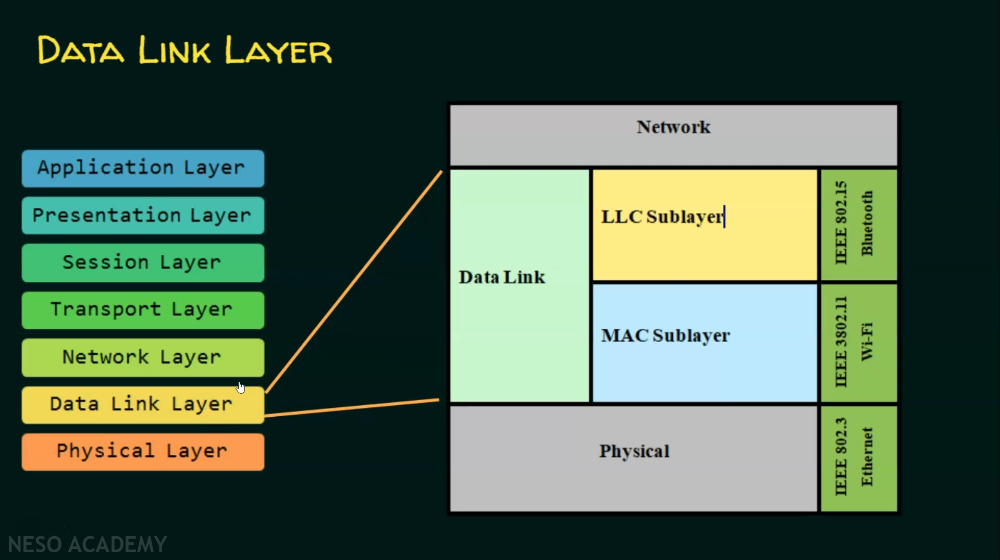

# chapter 2: Data Link Layer

## Link layer services:

- data link layer is the layer 2 in the OSI reference module data link layer offer 5 sevices. is responsible for moving data frames from one node to another .

### Services provided by data link layer

1) Farming
2) Pysical Addressing
3) Flow Control
4) Error Control
5) Access Control

## Framing:

### Sub-layers of the Data Link Layer:

    

### framing and framing types and framing approach:

### bit oriented approach / byte oriented approach:

### data link layer protocols:

#### HDLC (High-Level Data Link Control):

